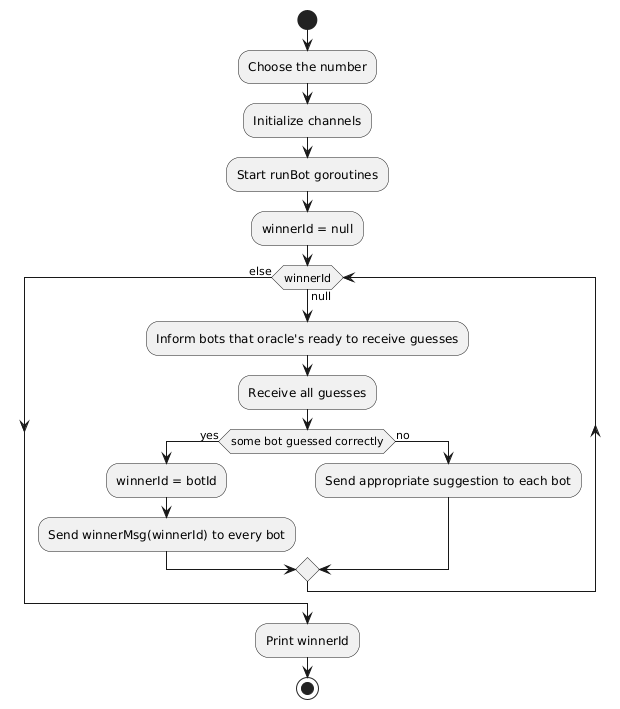
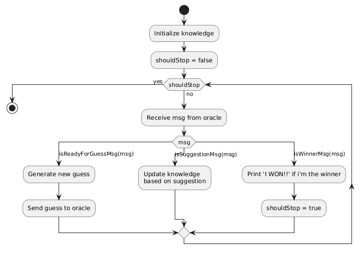

# Report

## Consegna

In questa parte si propone un esercizio per approfondire la conoscenza pratica della programmazione concorrente basata su scambio sincrono di messaggi, prendendo come riferimento il linguaggio Go.

Si vuole implementare il seguente gioco, denominato "Guess the Number"

Il gioco consiste in un certo numero di N agenti giocatori (bot) concorrenti che devono indovinare il numero estratto a caso da un agente oracolo.

Il numero estratto dall'oracolo deve essere compreso fra 0 e MAX, dove MAX è un parametro in ingresso dell'applicazione. Ad ogni turno, i giocatori devono provare ad indovinare il numero estratto dall'oracolo, proponendo un valore. Se il valore proposto coincide con quello dell'oracolo, l'oracolo dichiara il vincitore inviando un messaggio di vittoria al player vincente e di sconfitta al resto dei giocatori, concludendo così il gioco. Se il numero non coincide, allora l'oracolo invia una risposta al giocatore con un suggerimento, relativo al fatto che il numero da indovinare sia maggiore o minore di quello proposto. Ad ogni turno tutti i giocatori devono proporre il proprio tentativo, una e una sola volta. L'ordine con cui i giocatori devono inviare la proposta ad ogni turno non è deterministico: ad ogni turno l'oracolo segnala a tutti i giocatori quando è possibile inviare il proprio tentativo e alla ricezione del messaggio, i giocatori devono concorrentemente inviare il proprio valore. L'oracolo considererà i valori in ordine di arrivo.

## Utilizzo

Modificare a piacere [i parametri di ingresso](./main.go#L9) (numero massimo e numero di bot) e poi eseguire:

```sh
go run .

# Value to guess is: 185
# 3 bots are playing
# Bot 0 guessed 90
# Bot 1 guessed 116
# Bot 2 guessed 28
# Bot 0 guessed 158
# Bot 1 guessed 140
# Bot 2 guessed 151
# Bot 0 guessed 183
# Bot 1 guessed 146
# Bot 2 guessed 169
# Bot 1 guessed 185
# Bot 2 guessed 181
# Bot 0 guessed 196
# Bot 1: I WON!!
# Winner is bot 1
```

## Funzionamento

L'oracolo presenta il seguente funzionamento:

Questo diagramma è una semplificazione della funzione [main](./main.go#L41)

Ogni bot presenta il seguente funzionamento:

Questo diagramma è una semplificazione della funzione [runBot](./main.go#L12)

## Dettagli implementativi

Dati N bot l'oracolo utilizza N+1 `channels`.

Uno per ogni bot ([coordinationChannels](./main.go#L51)) attraverso il quale l'oracolo invia messaggi di coordinamento:

- per informare che è pronto a ricevere un nuovo tentativo
- per dare il suggerimento dopo un tentativo errato
- per informare i bot del vincitore e quindi della fine del gioco

E uno ([guessChannel](./main.go#L48)) nel quale i bot inseriranno i loro tentativi.
